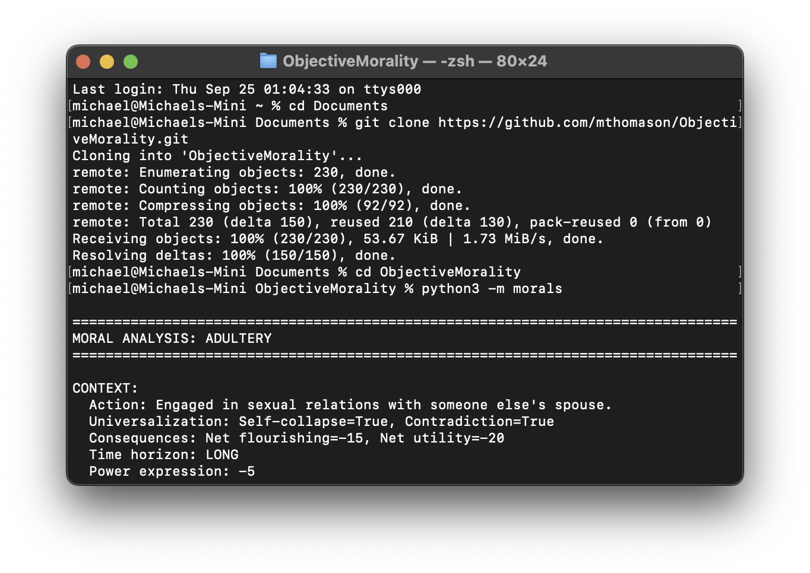

# Objective Morality

Objective Morality is a Python project that provides a framework for analyzing ethical dilemmas from various philosophical perspectives. It's designed to be a tool for teaching and exploring the differences between philosophical ideas and how they relate to one another. By defining a "moral context" for a given action, you can see how different ethical engines would evaluate that action, providing a side-by-side comparison of their conclusions.

This project is intended for educational purposes, particularly in a university setting, to help students understand the practical application of ethical theories.

## Features

*   **Multiple Moral Engines:** The project includes implementations of several major ethical frameworks:
    *   Kantian Deontology
    *   Utilitarianism
    *   Aristotelian Virtue Ethics
    *   Social Contract Theory (Contractualism)
    *   Rossian Pluralism
    *   Nietzschean Ethics
    *   Ethics of Care
    *   Rawlsian Justice
*   **Customizable Scenarios:** Define your own ethical dilemmas by creating simple JSON files that describe the "moral context" of an action.
*   **Comparative Analysis:** The output clearly shows the judgment of each philosophical engine, allowing for easy comparison.
*   **Consistency-Checking:** The system runs checks to highlight logical tensions or divergences between the verdicts of different engines.
*   **Typed and Extensible:** The codebase uses Python's type hinting for clarity and is designed to be easily extended with new moral engines or context parameters.

## Getting Started

### Prerequisites

*   Python 3.x

### Installation

1.  Clone the repository:
    ```bash
    git clone https://github.com/mthomason/ObjectiveMorality.git
    cd ObjectiveMorality
    ```
2.  There are no external libraries to install.

### Running the Program

To run the demonstration with the pre-defined moral scenarios, execute the following command from the root directory:

```bash
python3 -m morals
```

This will run the analyses for all the scenarios defined in `morals/main.py` and print the results to the console.



## Usage

There are two ways to create new moral scenarios: by editing the main Python file directly or by creating a separate JSON file. For beginners, we recommend editing the Python file.

### Method 1: Editing the Python File (Recommended for Beginners)

This is the easiest way to see how the scenarios are constructed and to create your own.

**Step 1: Open the main file**

Navigate to the `morals/` directory and open the `main.py` file in a text editor.

**Step 2: Find the examples**

Scroll down in the file. You will see sections clearly marked for each moral case, such as "Moral Case: Adultery" and "Moral Case: Pork Modern".

**Step 3: Copy an existing example**

To create your own scenario, the easiest way is to copy an entire existing moral case block. For example, you could copy the whole "Moral Case: Charity" section, from the comment line to the `engine_runner.run_engines(...)` line.

**Step 4: Paste and modify your new scenario**

Paste the copied block at the end of the other examples (but before the `display_results` section). Now, you can modify it:

1.  **Change the context variable name:** Rename `context_charity` to something unique, like `context_my_scenario`.
2.  **Update the action description:** Change the text in `action_description` to describe your new dilemma.
3.  **Adjust the parameters:** Change the values for `net_flourishing`, `duties_violated`, etc., to match your new scenario. The comments in the examples will help you understand what each parameter means.
4.  **Run your scenario:** Make sure to update the `engine_runner.run_engines(...)` call to use your new context variable name (e.g., `result_my_scenario = engine_runner.run_engines("my_scenario", context_my_scenario)`).
5.  **Display the results:** Add a line to the display section at the bottom of the file, like `engine_runner.display_results("my_scenario", context_my_scenario, result_my_scenario)`.

**Step 5: Run the program**

Save the `main.py` file and run the program as before. You will see the analysis for your new scenario in the output.

### Method 2: Creating a JSON file

This method is for more advanced users who are comfortable with JSON.

Moral scenarios can also be defined as JSON files in the `moral_data/` directory. Each JSON file represents a "moral context". You can see examples like `adultery.json` in that folder. To add a new scenario via JSON, you would create a new file and then load it in `main.py` using the `context_manager.load_context()` function, similar to how the "adultery" example is loaded.

### Interpreting the Output

The output for each scenario is divided into several sections:

1.  **Context:** A summary of the input parameters for the moral scenario.
2.  **Quick Consensus:** A high-level overview grouping the philosophies by a core judgment of GOOD, BAD, or NEUTRAL.
3.  **Detailed Analysis:** The specific verdict from each moral engine, along with a brief explanation of its meaning.
4.  **Core Moral Value Mapping:** A list showing which philosophers fall under each core judgment.
5.  **Cross-Engine Consistency Report:** (Optional) If any logical inconsistencies are detected between the engines, they will be reported here.

## The Moral Engines

*   **Kantian Engine:** Evaluates actions based on the Categorical Imperative. An action is impermissible if universalizing it would lead to a logical contradiction or a contradiction in will.
*   **Utilitarian Engine:** Focuses on the consequences of an action, judging it based on whether it produces the greatest good (utility or flourishing) for the greatest number.
*   **Aristotelian Engine:** Assesses actions based on whether they align with a virtuous character and contribute to a flourishing life (*eudaimonia*).
*   **Contractualist Engine:** Judges actions based on whether they would be permitted by rules that free, equal, and rational people would agree to.
*   **Rossian Engine:** Balances multiple *prima facie* (self-evident) duties to determine the right course of action in a specific context.
*   **Nietzschean Engine:** Analyzes actions based on whether they express a "will to power" and affirm life (Master Morality) or stem from weakness and resentment (Slave Morality).
*   **Ethics of Care Engine:** Prioritizes the maintenance of relationships and the needs of specific, vulnerable individuals over abstract principles.
*   **Rawlsian Engine:** Evaluates actions from behind a "veil of ignorance," focusing on whether they are just and do not disadvantage the least well-off members of society.

## Future Directions

This project is under active development. Some of the planned features include:

*   **Additional Moral Engines:**
    *   Divine Command Theory
    *   Existentialist Ethics
    *   Buddhist Ethics
*   **Resolution Engine:** A system to provide guidance when the moral engines produce conflicting results.
*   **Markdown Output:** The ability to generate the analysis in a Markdown format for easier sharing and documentation.

## Contributing

Contributions are welcome! If you have suggestions for new features, improvements, or new moral engines, please open an issue or submit a pull request.

## License

This project is released into the public domain. See the [LICENSE](LICENSE) file for more details.
